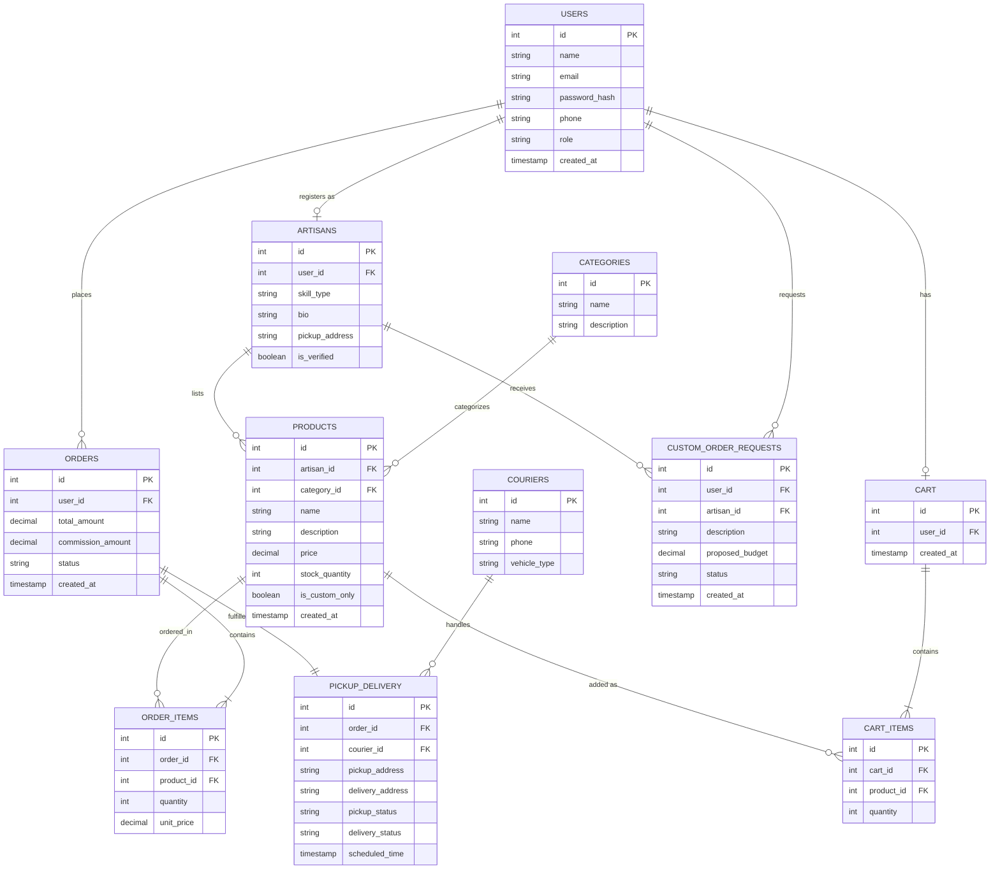

# Sprint 1: System Architecture & Scope Definition

**Project Name:** Kaarigar — Local Artisan/Handicraft Marketplace
**Course:** E-Commerce
**Sprint:** 1 — Architectural Planning & Domain Modeling

---

## 1. Target Audience & Market Focus

**Primary Persona:**
Home-based artisans and small-town craftspeople (with a strong focus on women and individuals lacking access to formal business infrastructure) who create handmade goods — embroidery, pottery, ajrak, jewelry, woodwork, and similar traditional crafts — but have no practical channel to sell beyond their immediate locality. The secondary persona is retail consumers seeking authentic, locally made handicrafts and willing to place custom/special orders.

**Core Pain Point:**
Independent artisans are excluded from mainstream e-commerce because they cannot manage inventory logistics, packaging, or courier bookings, and because general marketplaces charge commissions (15–30%) that make small-scale handmade selling unviable. Buyers, in turn, struggle to discover authentic local artisans outside large curated marketplaces.

**Domain Scope:**
Handicrafts & Handmade Goods (vertical: home décor, textiles/embroidery, pottery, jewelry, woodwork), including support for custom/special-order commissions.

---

## 2. MVP Feature Scope

| Category | Feature Name | Description | Priority |
|---|---|---|---|
| Authentication | User & Artisan Registration | Role-based signup (Buyer / Artisan) with password hashing and JWT-based authentication. | High (MVP) |
| Catalog | Product Listing & Search | Artisans list products with category/tag-based browsing and search for buyers. | High (MVP) |
| Cart | Cart Management | Persistent cart supporting item addition, quantity update, and removal. | High (MVP) |
| Checkout | Order Processing & Commission | Mock/Stripe-style payment gateway integration; order total calculated with a 1% platform commission (1–5% for custom orders); order object instantiation. | High (MVP) |
| Logistics | Courier Pickup & Delivery | Order triggers a pickup request from the artisan's registered address and delivery to the buyer, tracked via status updates. | High (MVP) |
| Custom Orders | Special Order Requests | Buyers submit a custom request (description, budget) to an artisan, who can accept/reject and set a custom price. | Medium |
| Admin | Artisan & Inventory Control | Artisan-side CRUD for their own product listings; admin-side verification of new artisan accounts. | Medium |

---

## 3. Tech Stack Selection & Justification

- **Frontend Framework:** React (with Vite)
  *Justification:* React's component model suits a catalog-heavy UI with reusable product/cart cards, and its large ecosystem shortens development time within the semester constraint compared to a heavier framework like Angular.

- **Backend Infrastructure:** Node.js with Express
  *Justification:* A single JavaScript runtime across frontend and backend reduces context-switching for a small student team, and Express's minimal, unopinionated routing is well suited to a REST API of this scope compared to a more heavyweight framework like Spring Boot.

- **Database Management System:** PostgreSQL
  *Justification:* The domain is inherently relational (users, artisans, products, orders, deliveries all reference one another via foreign keys), and PostgreSQL enforces referential integrity and supports the normalized schema needed for accurate commission and order tracking better than a document store like MongoDB.

- **Caching & Asynchronous Processing (Optional):** Redis
  *Justification:* Redis can cache session tokens and frequently browsed product/category listings, and later queue pickup-notification jobs to couriers asynchronously without blocking the checkout flow.

---

## 4. Entity-Relationship Diagram (ERD)

### Relationship & Cardinality Notes
- **USERS → ORDERS**: 1:N — a user can place many orders.
- **USERS → ARTISANS**: 1:1 (optional) — a user may hold one artisan profile.
- **ARTISANS → PRODUCTS**: 1:N — an artisan lists many products.
- **CATEGORIES → PRODUCTS**: 1:N — a category groups many products.
- **ORDERS → ORDER_ITEMS**: 1:N (associative entity mapping Orders to Products).
- **PRODUCTS → ORDER_ITEMS / CART_ITEMS**: 1:N.
- **ORDERS → PICKUP_DELIVERY**: 1:1 — each order has one fulfillment record.
- **COURIERS → PICKUP_DELIVERY**: 1:N — a courier handles many deliveries.
- **ARTISANS / USERS → CUSTOM_ORDER_REQUESTS**: N:M realized via this associative entity (one buyer, one artisan per request; either can have many requests).

---

## Notes
- Platform commission is fixed at **1%** for standard catalog orders and **1–5%** for custom/special-order commissions, reflected in `ORDERS.commission_amount`.
- Logistics is artisan-side pickup (no shipping burden on the artisan) rather than buyer/seller self-managed shipping — this is the platform's core differentiator against existing Pakistani handicraft marketplaces.
