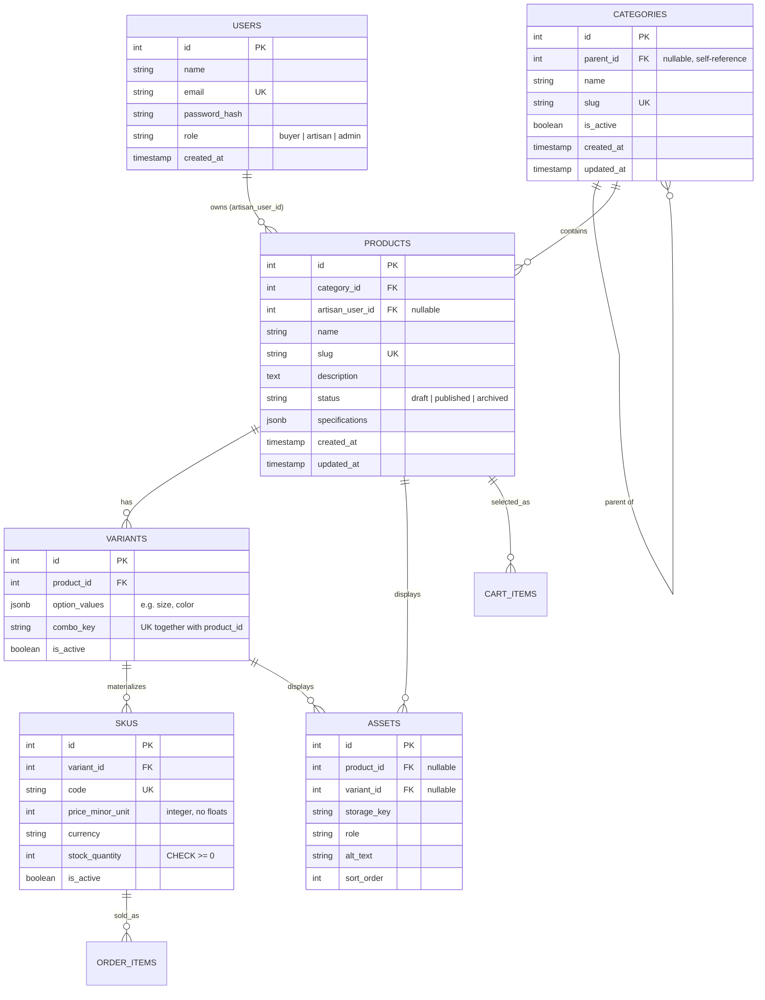

# Sprint 2: Catalog Data Foundation

**Project:** Kaarigar — Local Artisan/Handicraft Marketplace
**Course:** E-Commerce
**Sprint:** 2 of N — Catalog Data Foundation (15-day implementation sprint)

---

## 1. Sprint Goal and Scope Boundary

**Goal:** Given a product catalog administrator, the system persists categories, products,
variants, and SKUs without losing identity, relationship, price, or inventory meaning.

**In scope (delivered this sprint):**
- Category tree management (stable IDs, unique slugs, parent/child, cycle prevention).
- Product creation and editing (status, descriptive content, category assignment).
- Variants and SKUs with unique codes, price, stock, and validated combinations.
- Authenticated, role-restricted administration (JWT) for all of the above.
- Migrations, DB-level constraints, seed data, and automated tests.

**Explicitly out of scope this sprint** (per the Sprint 2 manual): dynamic specification UI,
asset upload, public catalog search, publication workflows beyond a simple status flag,
payment integration, order placement, shipping, and the shopper-facing checkout flow. Where
the required data model asked for entities that support this later work (`assets`,
`specifications`), the **table shape** was created now so Sprint 3 does not need a breaking
schema change — but no upload/search functionality was built against them.

---

## 2. Link to Sprint 1 Decisions Reused or Changed

Sprint 1 (`docs/SPRINT_1.md`) fixed the tech stack (React, Node.js/Express, PostgreSQL,
optional Redis) and an initial ERD with `USERS`, `PRODUCTS`, `CATEGORIES`, `ORDERS`,
`ORDER_ITEMS`, `CART`, `CART_ITEMS`, plus the marketplace-specific `ARTISANS`,
`CUSTOM_ORDER_REQUESTS`, `COURIERS`, and `PICKUP_DELIVERY` entities.

**Reused as-is:** Node.js/Express + PostgreSQL stack; the `USERS` entity (now also carrying
`role` for admin authentication); the general shape of `PRODUCTS` → `ORDER_ITEMS` /
`CART_ITEMS`.

**Changed / extended, with justification:**
- Sprint 1's `PRODUCTS` had no way to represent size/color options or multiple sellable
  units. Sprint 2 splits this into `PRODUCTS` → `VARIANTS` → `SKUS`, so a SKU (not the
  product) is the sellable, priced, stocked unit — this is what Sprint 1's `ORDER_ITEMS`
  and `CART_ITEMS` should reference going forward instead of `PRODUCTS` directly.
- Sprint 1's `ARTISANS` table (separate profile entity) is simplified for now to a `role`
  column plus `artisan_user_id` on `PRODUCTS`, since Sprint 2 does not yet need
  artisan-specific fields beyond ownership. The dedicated `ARTISANS` table can be
  reintroduced in a later sprint without breaking this foreign key.
- `COURIERS` and `PICKUP_DELIVERY` from Sprint 1 are untouched — logistics is still Sprint
  3+ scope and is not implemented here.

---

## 3. Updated ERD and Data Dictionary



*(`CART_ITEMS` and `ORDER_ITEMS` are Sprint 1 entities, referenced here only to show where
`PRODUCTS`/`SKUS` plug in — they are not re-implemented this sprint.)*

### Cardinality
| Relationship | Cardinality | Delete/Update Policy |
|---|---|---|
| `CATEGORIES.parent_id → CATEGORIES.id` | 1:N (self) | `ON DELETE RESTRICT`, `ON UPDATE CASCADE` |
| `PRODUCTS.category_id → CATEGORIES.id` | 1:N | `ON DELETE RESTRICT`, `ON UPDATE CASCADE` |
| `PRODUCTS.artisan_user_id → USERS.id` | 1:N (nullable) | `ON DELETE SET NULL`, `ON UPDATE CASCADE` |
| `VARIANTS.product_id → PRODUCTS.id` | 1:N | `ON DELETE CASCADE`, `ON UPDATE CASCADE` |
| `SKUS.variant_id → VARIANTS.id` | 1:N | `ON DELETE CASCADE`, `ON UPDATE CASCADE` |
| `ASSETS.product_id / variant_id → PRODUCTS.id / VARIANTS.id` | 1:N (nullable, at least one required) | `ON DELETE CASCADE`, `ON UPDATE CASCADE` |

**Why `RESTRICT` on categories/products but `CASCADE` below the product:** categories and
products are never hard-deleted in this system (only deactivated/archived — see Section 5,
Q7), so `RESTRICT` is a safety net that should never actually fire. Variants, SKUs, and
assets are true children of a product with no independent lifecycle, so cascading delete is
correct and matches how the admin UI manages them (delete the product's draft → its unused
variants/SKUs go with it).

---

## 4. Administration Route Table (as implemented)

Base path: `/api/v1`. All `/admin/*` routes require `Authorization: Bearer <JWT>` from
`POST /auth/login`, and the token's `role` must be `admin`.

| Method | Route | Purpose |
|---|---|---|
| POST | `/auth/login` | Authenticate and receive a JWT. |
| GET | `/admin/categories` | List the category tree. |
| POST | `/admin/categories` | Create a category (`name`, optional `parent_id`). |
| PATCH | `/admin/categories/:id` | Update `name` and/or `parent_id` (cycle-checked). |
| PATCH | `/admin/categories/:id/deactivate` | Soft-deactivate a category. |
| GET | `/admin/products` | List all products (admin view, any status). |
| POST | `/admin/products` | Create a draft product. |
| PATCH | `/admin/products/:id` | Update content, category, or `status`. |
| POST | `/admin/products/:id/skus` | Add a SKU; creates or reuses the matching variant. |
| PATCH | `/admin/skus/:id` | Update `price_minor_unit`, `stock_quantity`, `is_active`. |

### Example evidence (redacted, captured against a live local instance)

**1. Admin login**
```
POST /api/v1/auth/login
{"email":"admin@kaarigar.pk","password":"Admin@123"}

200 OK
{"token":"[REDACTED_JWT]","user":{"id":1,"name":"Kaarigar Admin","email":"admin@kaarigar.pk","role":"admin"}}
```

**2. Create category**
```
POST /api/v1/admin/categories   { "name": "Woodwork" }

201 Created
{"data":{"id":34,"parent_id":null,"name":"Woodwork","slug":"woodwork","is_active":true, ...}}
```

**3. Create draft product**
```
POST /api/v1/admin/products
{ "name": "Hand-Carved Wooden Jewelry Box", "category_id": 34,
  "description": "Sheesham wood box carved by local artisans." }

201 Created
{"data":{"id":34,"status":"draft","slug":"hand-carved-wooden-jewelry-box", ...}}
```

**4. Attempt to publish with no SKU → rejected**
```
PATCH /api/v1/admin/products/34   { "status": "published" }

422 Unprocessable Entity
{"error":{"code":"PUBLISH_REQUIRES_SKU","message":"A product cannot be published without at least one active SKU."}}
```

**5. Add a SKU (variant created automatically from `option_values`)**
```
POST /api/v1/admin/products/34/skus
{ "option_values": {"size":"Medium"}, "code": "WOOD-BOX-MED",
  "price_minor_unit": 350000, "stock_quantity": 6 }

201 Created
{"data":{"sku":{"id":34,"code":"WOOD-BOX-MED","price_minor_unit":350000,"stock_quantity":6,...},
         "variant":{"id":34,"option_values":{"size":"Medium"},"combo_key":"size=medium",...}}}
```

**6. Publish now succeeds**
```
PATCH /api/v1/admin/products/34   { "status": "published" }

200 OK
{"data":{"id":34,"status":"published", ...}}
```

**7. Duplicate SKU code → rejected with a clean client error, not a stack trace**
```
POST /api/v1/admin/products/34/skus   { "option_values": {"size":"Large"}, "code": "WOOD-BOX-MED", ... }

409 Conflict
{"error":{"code":"DUPLICATE","message":"A record with this unique value already exists (duplicate slug or SKU code).",
          "detail":"Key (code)=(WOOD-BOX-MED) already exists."}}
```

---

## 5. Data Integrity and Authorization Decisions

**Authentication/authorization:** `requireAuth` rejects any request without a valid
`Bearer` JWT (401). `requireRole('admin')` then rejects a validly-authenticated non-admin
(403). Both run before any controller logic, so an unauthorized request never touches the
database (CAT06).

**Business-rule answers (required by the Sprint 2 manual, Section 8):**

1. **Can a draft product have no SKU? Can a published product have no sellable SKU?**
   A draft may have zero SKUs — this is the normal state while an artisan is still setting
   up a listing. A published product may **not**: `PATCH /admin/products/:id` rejects a
   `status: "published"` transition unless at least one active SKU exists under the
   product (demonstrated in Section 4, examples 4 and 6).

2. **Is a product assigned to one canonical category, many categories, or both?**
   One canonical category (`products.category_id`, `NOT NULL`). For this semester-scoped
   MVP, a single category keeps navigation and the admin form simple; a many-to-many tag
   table is a reasonable Sprint 3+ enhancement if cross-listing is needed, and can be added
   without touching this column.

3. **What happens when a parent category is deactivated?**
   `PATCH /admin/categories/:id/deactivate` only flips that row's `is_active` to `false` —
   it does **not** cascade to children in the database, so no data is lost and child
   categories keep their own independent `is_active` state. Since public catalog reads are
   out of scope this sprint, "effective" visibility (parent inactive ⇒ hide descendants
   too) is a query-time concern left for the Sprint 3 public read API.

4. **How is an out-of-stock SKU represented in a public response?**
   The SKU row is not deleted or deactivated — `stock_quantity` simply reaches `0`, and
   `is_active` stays `true` (it is still a valid, orderable-when-restocked SKU). A public
   endpoint (Sprint 3) is expected to add a derived `in_stock: stock_quantity > 0` field
   rather than storing that as its own column.

5. **Can two SKUs share a price? Can a SKU have a price override?**
   Yes and yes. Price lives only on `skus.price_minor_unit` — there is no product-level
   price to inherit from, so every SKU's price is already an independent value by
   construction, and nothing stops two SKUs from coincidentally sharing one.

6. **What prevents negative stock and duplicate SKU codes?**
   Two layers: application validation in `skus.controller.js` rejects a non-integer or
   negative `stock_quantity` / non-positive price before any query runs, **and** the
   database itself enforces `CHECK (stock_quantity >= 0)`, `CHECK (price_minor_unit > 0)`,
   and `UNIQUE (code)` — so the rule holds even if a future code path bypasses the
   application layer (verified directly in `tests/skus.test.js`).

7. **What happens to a product referenced by a future cart or order after it is
   deactivated?** Products (and categories) are never hard-deleted — `status` moves to
   `"archived"` instead. Because the row still exists, any historical `ORDER_ITEMS` /
   `CART_ITEMS` foreign key from Sprint 1 remains valid; an archived product simply should
   not be returned by future "browse" endpoints.

---

## 6. Seed Data and Demonstration Instructions

```bash
npm install
cp .env.example .env        # fill in DB credentials
npx knex migrate:latest
npx knex seed:run
npm start                   # server on http://localhost:4000
```

Seed data creates:
- **Categories (2 levels):** `Handicrafts` (root) → `Textiles & Embroidery` (child);
  `Pottery` (root, sibling).
- **Products (3+):** *Hand-Embroidered Ajrak Shawl* (published, 2 variants), *Blue Pottery
  Vase* (published, 1 variant), *Sindhi Rilli Cushion Cover* (**draft, 0 SKUs** —
  demonstrates Q1), *Sindhi Rilli Table Runner* (published, 1 variant, stock `0`).
- **SKUs (4 valid):** `AJRAK-SHAWL-S-RED`, `AJRAK-SHAWL-L-RED`, `POTTERY-VASE-BLUE-STD`,
  `RILLI-RUNNER-STD`.
- **One intentionally unavailable combination:** `{size: "Large", color: "Green"}` for the
  Ajrak Shawl is **not** created as a variant or SKU at all — per CAT04, an unoffered
  combination must not exist as a fake or zero-stock row, so its absence *is* the
  demonstration.
- **Admin login:** `admin@kaarigar.pk` / `Admin@123` (seeded via bcrypt hash — never commit
  this password to a real production seed).

The live request/response evidence in Section 4 was captured by running the commands above
against a local PostgreSQL instance and calling the admin API with `curl`.

---

## 7. Test Strategy, Command, and Result

**Strategy:** Jest + Supertest against a **real PostgreSQL test database** (not mocks), so
constraint violations (unique, check, FK) are exercised for real, not assumed. Each test
file creates its own admin user/token; `tests/setup.js` runs migrations once and truncates
all catalog tables after every test for isolation.

**Command:**
```bash
NODE_ENV=test npx knex migrate:latest --env test
npx jest --runInBand
```

**Result (last run against a live Postgres 16 instance):**
```
PASS tests/skus.test.js
PASS tests/products.test.js
PASS tests/categories.test.js
PASS tests/auth.test.js

Test Suites: 4 passed, 4 total
Tests:       19 passed, 19 total
```

**Coverage by required area:**
- Product/SKU creation with required fields — `products.test.js`, `skus.test.js`.
- Duplicate slug / duplicate SKU rejection — `categories.test.js`, `products.test.js`,
  `skus.test.js`.
- Category hierarchy validation incl. cycle prevention — `categories.test.js`.
- Variant/SKU combination reuse and stock rules (app-level **and** DB-level negative-stock
  rejection) — `skus.test.js`.
- Authorization failure for admin endpoints (401 unauthenticated) — `categories.test.js`.

---

## 8. Known Limitations and Sprint 3 Backlog

- No public (unauthenticated) catalog read endpoints yet — everything here is admin-only.
- `specifications` uses validated JSONB on `products` (flat object, ≤20 keys, string/number
  values only) rather than a full EAV schema — chosen for MVP simplicity; documented so
  Sprint 3 can decide whether stricter per-category schemas are worth the extra tables.
- `ASSETS` table exists but has no upload endpoint — Sprint 3 owns image upload, storage,
  and serving.
- "Effective" visibility when a parent category is deactivated (Q3) is not yet computed
  anywhere — needs to land alongside the public catalog read API.
- No rate limiting or refresh-token flow on `/auth/login` yet.

Sprint 3 can safely build on: `categories`, `products`, `variants`, and `skus` as the
stable identity and pricing source of truth — no product or price logic should be
duplicated elsewhere.
